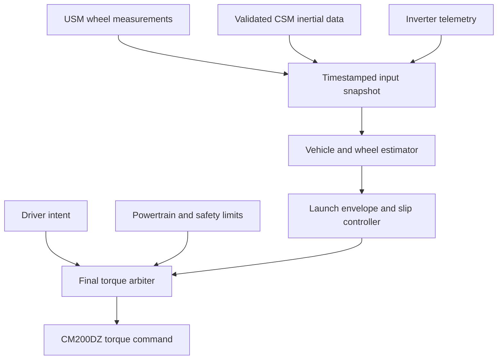

# Orion traction-control design and implementation review

Reviewed 2026-10-01 against `LonghornRacingElectric/lhre-2026`, commit
`d981057b8830f5f8be9c8b70a206dd2345748cd6` on `main`.
Implementation is on the local branch `codex/orion-traction-implementation`.
See [implementation status](orion_traction_implementation.md) for changes made
after this baseline audit. Sections describing existing behavior refer to the
audited main commit unless explicitly stated otherwise. The owner's Mac
working directory was unavailable, so uncommitted Mac changes and other branches
are outside this review. No firmware was flashed and no repository changes were pushed.

## 1. Recommended direction

Build traction control as a VCU-owned **positive motor-torque ceiling**, using
individual rear-wheel slip relative to a confidence-qualified vehicle-speed
estimate. Combine a calibrated launch torque envelope with feedback, preserve
driver and powertrain limits in a single final torque arbiter, and validate the
complete sensing-to-torque chain before enabling interventions.

The first development priority is measurement correctness and torque-path
correctness. The existing wheel data, corner IMU configuration, asynchronous
mailboxes, and stored inverter slew setting have larger consequences than the
choice between PI, an observer-based controller, or MPC.

Orion has one stated EMRAX 228 and one CM200DZ: there is one propulsion torque
actuator. Confirm the actual differential, gearing and motor winding before
choosing slip aggregation or converting motor torque into tire force. A more
elaborate algorithm cannot independently command left/right rear torque.

Use a gain-scheduled, confidence-aware feedback controller first. Retain an
acceleration/model residual as a supplementary launch or plausibility signal.
Investigate optimal-control approaches only when logs and a validated plant
model identify a limitation of this baseline. No architecture is demonstrably
optimal for Orion until it improves repeatable acceleration and corner-exit tests.

## 2. What the audited baseline implements

| Area | Audited implementation | Consequence |
|---|---|---|
| USM sensing | Four MLX90395 sensors; filtered radial-field threshold crossings | No continuous phase or sin/cos estimator yet |
| Wheel update | Task intends 1 ms updates; blocking SPI and periodic logging | Nominal task rate does not establish fresh sample rate |
| Wheel timestamps | Float seconds from RTOS millisecond tick | Quantization and long-uptime precision loss; no acquisition timestamp |
| Wheel publication | One combined acceleration + speed frame per corner, nominal 3 ms | No source timestamp, sequence, confidence or sensor validity |
| Network | USM on DAQ FDCAN2; VCU starts critical FDCAN1 and DAQ FDCAN2 | VCU can consume DAQ directly; no Pi forwarding is necessary |
| VCU sensor inputs | Pedals, battery and inverter inputs only | No wheel-speed, steering or IMU input reaches the model |
| VCU receive handlers | Critical-bus messages; no USM/CSM receive registration | Existing sensing traffic is not used for traction control |
| Existing TC | Disabled; raw motor-speed differentiation and one-sided PI trim | Acceleration limiting, rather than measured wheel-slip regulation |
| VCU schedule | Relative 3 ms delay after work; steering ADC can block for 10 ms | Actual loop interval is variable |
| Torque path | Torque map, derate, power limit, TC, PRNDL, regen, final state gate | Requires explicit separation of intent, propulsion and regen |
| Inverter command | 0xC0, eight bytes, nominal 3 ms publication | Suitable interface after scheduling and freshness improvements |
| Inverter telemetry | VCU prefers 0xB0, falls back to 0xA5 | Saved inverter settings disable 0xB0; schema alone cannot enable it |
| IMUs | USM accelerometer path plus separate CSM sprung accel/gyro paths | Identify which hardware and streams are fitted and operational |

Relevant source files:

- [Wheel processing](../../../USM/firmware/usm/wheel_speed.c) and
  [wheel configuration](../../../USM/firmware/usm/wheel_speed.h).
- [USM task](../../../USM/firmware/Core/Src/app_freertos.c),
  [SPI](../../../USM/firmware/Core/Src/spi.c),
  [GPIO](../../../USM/firmware/Core/Src/gpio.c),
  [USM CAN](../../../USM/firmware/usm/usm_can.c).
- [VCU task](../../firmware/Core/Src/app_freertos.c),
  [VCU CAN](../../firmware/vcu/vcu_can.c),
  [model inputs](../inc/vcu_inputs.h), [model pipeline](../src/vcu_model.c).
- [Current TC](../components/TractionControl.c),
  [power limiting](../components/PowerLimit.c),
  [regen/linelock](../components/RegenLinelock.c).
- [Shared CAN receive/transmit tasks](../../../drivers/longhorn-lib/rtos/can.c),
  [CAN base](../../../drivers/longhorn-lib/can_base.c),
  [canonical CAN schema](../../../drivers/longhorn-lib/config/can_packets.csv).
- [CSM IMU](../../../CSM/firmware/Core/Src/imu.c) and
  [CSM task](../../../CSM/firmware/Core/Src/app_freertos.c).

The generated `*_FREQ` CAN constants represent **periods in milliseconds**.
For example, `INVERTER_TORQUE_COMMAND_FREQ = 3` means approximately 333 Hz.
Rename this concept to `PERIOD_MS` when the generator is changed; do not edit
generated artifacts independently of the schema/generator.

## 3. Correctness issues to resolve first

### 3.1 Torque-path issues

**PowerLimit bypassed battery derating.** `TorqueMap.c` computes
`torque_derated`, but the baseline `PowerLimit.c` clamped and subtracted its trim
against `torque_lookup_output`. A 100 Nm request derated to 50 Nm could become
100 Nm again downstream. This review fixes the stage to operate on
`torque_derated` and adds a host regression at the actual TorqueMap-to-PowerLimit
boundary. Review this as a separate prerequisite change.

**The present TC should remain disabled.** It differentiates RPM using a fixed
0.003 s even when the model's supplied interval differs; it calculates a filtered
acceleration but controls on the raw derivative. An unchanged RPM value resets
the integral and immediately releases trim. It has no sample timestamp, ignores
`motor_speed_valid`, does not guard NaN/Inf, and accumulates integral even when
zero driver demand prevents any realized torque reduction.

A standalone characterization reproduces these behaviors. It is deliberately
excluded from regression CI: observing a defect is not the desired future
controller contract. Replace its checks with desired behavior when TC is rebuilt.

**Driver intent and linelock intent must be separate from TC output.**
`RegenLinelock.c` uses already-trimmed `out->torque_cmd` as a pedal-torque signal
for hydraulic release pulses. TC interventions could therefore change linelock
behavior. Give that logic its explicit intended driver-request signal, and put
propulsion and regen requests through an explicit final arbiter.

**Brake policy is an unresolved prerequisite, not an accidental test failure.**
The current model excludes `brake_any_fault` from global fault aggregation, and
an existing test intentionally permits positive torque while the brake latch is
set. The `can_timed_out()` model function is also a stub. Confirm the team's
actual shutdown, braking and event-rules policy and encode it explicitly before
active TC. Do not silently change this behavior under the guise of tuning TC.

The missing declaration of `vcu_can_get_torque_feedback_nm()` is added to the
VCU CAN header in this review. A float-return function called without a matching
prototype is a build/ABI issue; this does not fix the getter's missing freshness
semantics.

### 3.2 CAN payload freshness and concurrency

The receive ISR updates `_latest_rx_ms` even though the RTOS hook only enqueues
the bytes. The queue entry contains no receive time, the queue-full result is
ignored, and unpacking happens later. Consequently an old decoded payload can
look fresh because a newer frame arrived or was dropped. Receive handles are
also initially timestamped before any message has been received.

Required changes:

1. Carry ID/interface, receive timestamp, DLC and bytes through the queue.
2. Track `ever_received`, decode success, queue drops and malformed length.
3. Publish the decoded payload and its metadata together, only after decoding.
4. Expose one coherent sensor snapshot to the control task.
5. Use a short critical-section copy or carefully implemented double buffer.
   Do not use unbounded locks or blocking SPI/CAN operations in the control task.
6. Instrument FIFO/queue occupancy and overrun counts.

The TX task likewise serializes mailboxes while the control task changes their
individual fields. Publish torque, enable, direction, mode and limit atomically.
The shared transmit service can busy-wait for FIFO space and delays relatively;
replace that behavior for control traffic with bounded, nonblocking service and
latest-command semantics. Do not replay a queue of stale high-torque commands
after bus congestion. Preserve the required disable/startup sequencing.

### 3.3 Wheel-sensor driver correctness

For the previously specified **MLX90395KLW-BBA-101-SP**, the manufacturer
specifies SPI mode 3 and a 1 MHz limit. The audited USM clock tree and prescaler
give approximately **9 MHz in mode 0**. Confirm the fitted ordering code, then
correct both CubeMX configuration and generated source. On the existing
144 MHz SPI clock, divider 128 is still 1.125 MHz; divider 256 gives 562.5 kHz.

All shared-SPI chip selects must be inactive before the first transaction.
Current GPIO initialization drives them low, while `WheelSpeed_Init()` raises
each Hall CS only immediately before initializing that sensor; the other Hall
devices and IMU can still be selected. Deselect every device first, then perform
bounded transactions with the correct per-device SPI configuration.

The current read command `0x40` has a complete Status/CRC/XYZ/T/V response,
while the driver reads nine bytes and ignores status, CRC, conversion freshness
and HAL return values. The XYZ byte offsets in the code are not the identified
problem; the transaction and integrity handling are incomplete. Implement the
selected response format explicitly and verify it with recorded SPI captures.
Use finite timeouts, fault counters, sensor reset/recovery, and status/configuration
readback. Do not treat successful bus transfer as proof of a new conversion.

### 3.4 Corner-IMU configuration

Two different implementations require independent verification:

- USM labels its device ASM330LHB but checks WHO_AM_I `0x70`. The official
  ASM330LHB ID is `0x6B`; `0x70` matches the LSM6DSV32X family used in CSM.
  The caller ignores initialization failure. Thus the intended accelerometer
  configuration is not evidence of the actual live rate or even a working IMU.
- CSM labels its device LSM6DSV32X. Its `CTRL1 = 0x74` selects 30 Hz rather than
  the stated 208 Hz. `CTRL2 = 0x0C` selects a high gyro ODR; gyro full scale is in
  another register that is not written. The scale constant assumes 4000 dps,
  while the reset full scale is 125 dps, implying approximately 32 times the
  correct scale from reset. Readbacks and the fitted device must confirm this.
  The task updates only when both accel and gyro are ready, then republishes
  held data over nominal 100 Hz CAN.
- CSM sends `imu_data.accel.y` into the ride-height field rather than the measured
  `distance_mm`. Correct this before using suspension signals for estimation.

Use device-specific register definitions or ST's matching driver, explicit ODR
and full-scale readbacks, data-ready/FIFO timestamps, bounded coherent reads,
and stationary/known-rotation scale checks. Explicitly verify block-data-update
behavior rather than assuming all parts share the same reset defaults.

## 4. Inverter and motor constraints

The stored configuration and the latest stored EEPROM export agree except for
a header timestamp. They document firmware 6533; they do not establish what is
flashed on the car today. Read back firmware ID and parameters before testing.

| Stored parameter | Value | Interpretation / action |
|---|---:|---|
| Command/run modes | 0 / 0 | CAN torque mode |
| CAN rate and base | 1000 kbps, 0xA0 | Standard IDs; match bus configuration |
| Torque slew parameter | 50 | 5 Nm per 3 ms; identify applied rise and fall response |
| Fast / slow broadcast periods | 10 / 100 ms | Inverter scheduling uses 3 ms increments |
| High-speed enable mask | High word 65535 | 0xB0 disabled in the stored configuration |
| Command timeout | 150 | 450 ms; reassess alongside task watchdogs |
| Counter debounce maximum | 0 | Rolling-counter checking disabled |
| Shudder compensation | Mode 2 | Includes a 10 Nm clamp and low-speed compensation |
| Motor type | 128 | Legacy setup guide maps to EMRAX 228 MV, 5X resolver |
| IQ limit | 4530 | 453 A peak, not RMS |

The CM command is processed every **3 ms**; faster command traffic is not a
documented route to faster response. The high-speed 0xB0 message also uses a
3 ms period. In torque mode, a command-limit field of zero selects EEPROM limits;
it is not a zero-torque command. Torque feedback is estimated, rather than a
shaft transducer measurement.

At 5 Nm per 3 ms, a nominal 100 Nm change needs approximately

\[
100/5\times3\ \mathrm{ms}=60\ \mathrm{ms}.
\]

This calculation describes the configured limiter, not a measured vehicle
step response. Do not increase it blindly: characterize rise/fall dynamics,
driveline oscillations and interaction with shudder compensation under load.

Confirm winding, cooling, resolver ratio, gear ratio, motor parameters and
nameplate revision. Current EMRAX product curves may differ from the installed
motor and legacy calibration. Establish a usable command-to-shaft-torque model
or uncertainty bound before using estimated torque for tire-force identification.
Do not move the initial controller to inverter speed mode merely to bypass a
torque ramp: speed mode changes torque authority and may request regeneration.

## 5. Proposed architecture



| Proposed module | Responsibility | Must not do |
|---|---|---|
| USM sensor driver | Fresh conversion, integrity, configuration and acquisition time | Hide failed/stale conversions as valid zero speed |
| USM wheel estimator | Calibrated phase/velocity, direction, uncertainty | Assume ideal sinusoidal magnets or fixed polling intervals |
| VCU measurement adapter | Decode, clock mapping, range checks, coherent snapshots | Control torque inside CAN interrupts |
| Vehicle estimator | Ground speed, per-wheel rolling reference, confidence | Trust a spinning wheel as ground truth |
| Launch envelope | Calibrated feedforward ceiling before reliable slip observation | Add torque above the driver's request |
| Slip controller | Positive propulsion ceiling and controlled recovery | Override driver release, safety gating or command regen |
| Torque arbiter | Own final signed command and limiting reason | Let downstream stages restore an upstream limit |
| Logger | Raw timing, measurement quality, controller and actuator outputs | Flood control buses with high-rate diagnostic traffic |

Keep estimator/controller/arbiter code pure C in `VCU/model`, independent of HAL
and RTOS. Add separate components such as `WheelStateEstimator`,
`VehicleSpeedEstimator`, `LaunchEnvelope` and `TorqueArbiter`; replace the
existing TC only once its new input contract and tests exist. Firmware supplies
timestamps and sensor snapshots, and consumes one final command structure.

## 6. Wheel-speed estimation on the current hardware

The present algorithm measures each sensor's own threshold-crossing period and
then selects the sensor with the latest crossing. Four staggered sensors do not
make that period a four-times-faster interleaved position measurement. A first
crossing uses `last_tick = 0`, so the interval depends on uptime. No direction
measurement is implemented; the internal `direction` variable is a hysteresis
state. Explicit stale/standstill handling is missing.

With six alternating magnets, one electrical cycle spans 120 mechanical degrees;
successive opposite threshold crossings nominally span 60 mechanical degrees.
For illustrative tire radius 0.23 m and acceleration 10 m/s², travel through
60 degrees from rest takes approximately

\[
t=\sqrt{2R\Delta\theta/a}=\sqrt{2(0.23)(\pi/3)/10}\approx219\ \mathrm{ms}.
\]

Actual startup timing depends on initial phase, filtering and threshold geometry.
This illustrates why faster CAN alone cannot yield the earlier phase-based
50 ms estimate. The algorithm's no-edge speed envelope falls below its
0.3 rad/s zero threshold only after roughly 3.49 s from the last edge.

Recommended approach for the existing boards:

1. Record unfiltered radial-axis readings from all four sensors versus known
   angle/speed, including launch, eccentricity, air gap, temperature and polarity.
2. The owner has now confirmed physical 15-degree spacing and three pole pairs.
   The audited threshold estimator did not use this geometry.
3. Pairs 0/2 and 1/3 are confirmed quadrature pairs, separated by 45 electrical
   degrees in origin. Account for individual package axes/signs; this confirmation
   does not establish waveform calibration or conversion timing.
4. Calibrate offsets/gains and phase alignment. Fit harmonics or a field-to-angle
   map if the discrete magnets do not provide sufficiently ideal sin/cos.
5. Estimate phase continuously and unwrap it. Use a time-aware observer or
   weighted local fit for velocity; do not differentiate noisy angles directly.
6. Publish uncertainty, freshness and sensor disagreement. Reset phase continuity
   explicitly after a reboot or unacceptable data gap.
7. Keep a corrected edge estimator as a fallback/plausibility check, with known
   edge positions and invalid first interval. Do not blend inconsistent methods
   without quality and delay models.

The existing field EMA uses alpha 0.05. Its low-frequency mean delay is about
19 sample intervals—approximately 19 ms at a true 1 kHz rate—and it attenuates
the waveform increasingly with electrical frequency. Select the observer/filter
from a measured noise and delay budget, not that fixed alpha.

A 2 kHz local target may be feasible with selected single-axis reads and
overlapped conversion. At 562.5 kHz, four complete 13-byte exchanges take about
740 microseconds of wire time alone; four selected single-axis five-byte
exchanges take about 284 microseconds. Confirm the exact selected response,
conversion settings, temperature-compensation overhead and fresh-data signaling.
The local estimator can run faster than its CAN publication.

The earlier 5/50 ms launch calculations assumed accurate continuous phase.
Measure Orion's phase noise and low-speed observability before converting those
examples into a requirement. A continuously running observer removes repeated
batch startup delay, but cannot create motion information at exact standstill.

## 7. Timing and communications contract

Define acquisition time, effective estimator time, receive time and command time
separately. A rolling sequence counter detects drops; it does not synchronize
four board clocks or the inverter. Map USM clocks to the VCU clock through an
explicit synchronization scheme, with offset/drift uncertainty. Consider a
periodic VCU synchronization frame captured at receive interrupt time, but account
for arbitration and ISR delay; sending a software timestamp alone is insufficient.

Predict each accepted wheel estimate to a common control time over a bounded
horizon. A period-derived speed represents an interval average; its meaningful
measurement time differs from the last edge time. An observer predicted to a
current source time should identify its confidence and last fresh information.

Suggested new eight-byte wheel-control packet, one unique ID per corner:

| Bytes | Field | Contract |
|---|---|---|
| 0–1 | Signed wheel speed | Proposed 0.01 rad/s scale; verify range against maximum wheel RPM |
| 2–5 | Source estimate timestamp | uint32 microseconds; explicit wrap/reboot handling |
| 6 | Measurement sequence | Advances with new estimator data; bounded gap/reorder checks |
| 7 | Status | Validity, time sync, direction known, prediction, saturation, fault/reset |

Allocate IDs through the canonical schema after checking both physical buses and
legacy users. Do not reuse 0x130–0x133; they already have other meanings. Specify
invalid values, sign, endian order, maximum prediction horizon and reset behavior.
Send slower diagnostic packets with last-fresh age, phase quality, uncertainty,
clock uncertainty and errors. The combined XYZ/speed packet has no room for this
metadata, so split control data from inertial/diagnostic telemetry.

Clock wrap occurs every approximately 71.6 minutes for a uint32 microsecond clock.
Use modular subtraction only within a documented interval, and distinguish wrap
from reboot. The inverter's 0xB0 has no measurement timestamp. Bound its age from
receive timing and known periodic behavior; do not assign it a synchronized USM
counter or treat the separate power-on timer as its sample timestamp.

Provisional development targets, subject to hardware measurements:

| Function | Starting target | Acceptance evidence |
|---|---|---|
| USM fresh acquisition | Evaluate 1–2 kHz selected-axis acquisition | Fresh conversions, bounded SPI time, phase noise vs speed |
| USM observer | Every fresh sample | Error and group delay measured against reference |
| Wheel control CAN | 333 Hz initially | Source age, drops and worst-case delay on DAQ bus |
| Body IMU acquisition | Validate 200–400 Hz if supported and useful | Correct scales, frames, timestamps, vibration and clipping |
| Inertial CAN | 100–200 Hz initially | Required estimator bandwidth and full DAQ load |
| VCU control | Fixed 3 ms deadline | Measured WCET/jitter/overruns; no blocking ADC/SPI |
| Inverter command/0xB0 | 3 ms, with verified enabling | CAN captures and actual actuator response |
| Slow diagnostic telemetry | 10–50 Hz | No control deadline interference |

For a first timing budget, evaluate a clock-alignment uncertainty below
250 microseconds and ordinary source-to-control age below approximately 8 ms,
excluding explicitly modeled filter delay. Treat loss of new source measurements
for approximately 10 ms as a candidate degradation threshold, not a final tuned
constant. Choose those values from observed jitter, estimator error and fault
consequences. Sensor information confidence can be poor even while fresh samples
arrive, particularly near standstill.

Timestamp mismatch creates apparent slip approximately

\[
\delta\kappa\approx a\Delta t/v.
\]

At 10 m/s² and 0.5 m/s, 1 ms gives about two percentage points; 250 microseconds
gives about half a percentage point. Thus a generic “within 1 ms” statement is
not an accuracy specification for launch.

Use absolute-deadline scheduling (or a hardware timer) for the VCU; remove the
blocking steering ADC poll from its critical path and run ADC DMA continuously.
An estimator updates on new measurement times; control runs on its own clock.
Record deadline misses and define a bounded response. A fixed task period alone
does not prove stability or sensor freshness.

Both configured physical buses are classical CAN at approximately 1 Mbps.
Budget them **separately**: wheel/CSM traffic is on DAQ, inverter and much VCU
traffic is on critical. Four eight-byte 333 Hz wheel frames consume roughly
14.8–18% of a 1 Mbps bus; at 1 kHz, roughly 44–54%, before inertial and other
traffic. Eight-byte standard frames take approximately 111–135 bits including
intermission and stuffing. These are planning estimates, not a response-time
proof. Include other active publishers, burst phasing, hardware FIFO behavior,
errors and retransmissions. Give control traffic deliberate priority and bound
worst-case queueing; move or slow redundant telemetry when necessary.

## 8. Vehicle-speed and per-wheel slip estimation

Assuming rear-wheel drive, use the unpowered fronts as initial ground-speed
references during propulsion. Correct rolling radius and cornering geometry,
reject implausible samples and qualify confidence. Front wheels can unload,
bounce, brake or lose contact; do not always take the smallest wheel speed.

For body velocity `(vx, vy)`, yaw rate `r`, wheel position `(xi, yi)` and road-wheel
steering angle `delta_i`, the planar rolling reference is

\[
v_{\parallel,i}=\cos\delta_i(v_x-r y_i)+\sin\delta_i(v_y+r x_i).
\]

Compare each rear wheel with its own reference. A shared straight-line reference
for both rear wheels creates false slip in turns. The current steering signal is
column angle sent only in telemetry; calibrate column-to-road-wheel geometry,
sign, offset and validity before using it in the model.

Calibrate effective rolling radius in confirmed low-slip running. Approximately
1% radius bias can create approximately one percentage point of slip. Freeze
radius adaptation during slip, braking, bumps/contact loss and unsuitable turns.
Use motor speed versus gearing times mean rear-wheel speed as a drivetrain
plausibility residual where the differential kinematics support it.

At low speed, control slip velocity

\[
s_i=R_i\omega_i-v_{\parallel,i}.
\]

At higher speed, use/report a defined slip ratio

\[
\kappa_i=s_i/\max(|v_{\parallel,i}|,v_{\min}).
\]

A practical smooth target is a low-speed slip-velocity allowance blended into
`kappa_target * |v_reference|`. Set that allowance from the measured uncertainty
and acceptable launch wheelspin. A denominator floor does not establish that
small launch slip can be observed. Qualify intervention with uncertainty,
hysteresis and persistence appropriate to actual signal delay.

For an open differential, axle-average speed can hide a spinning inside wheel.
Generate high-confidence per-rear-wheel motor-torque constraints and use the
more restrictive constraint. Avoid a permanent raw maximum of noisy slips. For
an LSD, characterize torque bias/preload/transient locking; for a spool, model
the unavoidable cornering speed constraint. Do not discard a likely spinning
wheel just because its acceleration is large.

## 9. How to use all-corner inertial measurements

Identify whether the user's corner signals are CSM sprung sensors, USM upright
sensors, or another fitted implementation. The distinction changes the observer.

Sprung sensors on the same rigid body can be transformed to a body reference
using orientation and lever-arm compensation:

\[
a_P=a_O+\dot\omega\times r_P+\omega\times(\omega\times r_P).
\]

Accelerometers measure specific force, so attitude/gravity correction is also
required. A robust fusion of validated sprung IMUs can support yaw and short-term
acceleration prediction. A body IMU near the center of gravity simplifies this
problem if the existing layout cannot meet the error budget.

Uprights are not fixed to the sprung chassis. Steering, suspension travel,
compliance and wheel hop add relative motion. Use their inertial measurements
first for vibration/impact/saturation and measurement-confidence diagnostics.
Do not simply average four upright acceleration vectors into vehicle acceleration,
and do not interpret vertical acceleration alone as tire load or proof of being
airborne. Suspension-aware fusion is a later model supported by validated ride
height, suspension position and reference testing.

Do not integrate corner acceleration indefinitely for ground speed. Use bounded
prediction between valid wheel observations and estimate bias with independently
validated body data. Record mounting transforms and calibration versions.

## 10. Launch feedforward and feedback

Launch feedforward is the response available **before reliable slip information**.
It predicts a useful torque envelope from previous tests; it cannot identify an
unseen grip loss instantly. Index the envelope by estimated speed and launch
state, with a conservative selectable grip calibration and bounded rise rate.
Time since launch can be a secondary input, but a time-only ramp does not account
for a poor launch or stalled progress.

As a first physical estimate, rear normal load during straight acceleration is

\[
F_{z,r}\approx F_{z,r,static}+m a_x h/L+F_{z,r,aero}.
\]

Then an axle-limited motor-torque ceiling is approximately

\[
T_{m,grip}\approx \mu_x F_{z,r}R_e/(G\eta).
\]

These equations are modeling starting points. Differential behavior, per-tire
load sensitivity, lateral demand, temperature and actual torque delivery change
the useful limit. Fit the launch envelope from measured runs. Reduce its grip
allowance during cornering; do not choose a universal slip target for every tire
and condition.

Use signed slip error in feedback, not `max(0, slip - target)` with an integral
that can only grow. A constrained PI trim or torque-ceiling regulator should:

- account for actual measurement/control intervals;
- integrate only when feedback is valid and control authority exists;
- unwind or track limits when the driver, power limit, safety gate or actuator
  prevents the requested action;
- initialize and transition without a torque step;
- reduce torque promptly and recover with a separately calibrated rate;
- clamp state and reject nonfinite inputs/configuration;
- use a speed-dependent gain/target/deadband informed by uncertainty;
- avoid differentiating raw wheel speeds as a derivative term.

Final positive propulsion must satisfy

\[
0\le T_{cmd}\le\min(T_{driver},T_{powertrain},T_{launch},T_{slip}).
\]

Apply recovery limiting to the **traction ceiling**, then take the final minimum.
Otherwise a slowly falling limiter can hold torque above a released pedal request.
Use final realized authority for anti-windup, with a bounded actuator model where
appropriate; do not equate delayed estimated-torque telemetry with a precise
instantaneous measurement. Explicitly log which limit won.

Regen requires separate negative-slip supervision and hydraulic/brake coordination.
Do not allow a propulsion trim to cross zero into regen, and do not use inverter
disable as routine traction modulation. Preserve the established shutdown paths.

## 11. Operating modes and degraded behavior

| Mode | Output behavior | Transition basis |
|---|---|---|
| Disabled | Normal validated torque path | Driver/team configuration |
| Shadow | Calculate/log candidate ceilings; no TC intervention | Development default |
| Armed | Estimator qualified, no excessive slip | Freshness, confidence, drive state |
| Active | Reduce positive torque within allowed request | Qualified excess slip |
| Recovering | Restore traction ceiling at bounded rate | Grip recovered with hysteresis |
| Degraded | Conservative envelope or bounded fallback | Sensor/time/confidence loss |
| Faulted | Defined fault-policy torque/enable action | Persistent severe fault |

If sensing fails while TC has removed torque, immediately dropping the ceiling
can restore full driver torque. Define a bounded transition to a conservative
envelope and log the reason. Choose persistent-fault behavior with the car's
existing safety policy; not every confidence dip is an inverter shutdown.

Test reset, counter wrap, timestamp wrap/jump, frozen-but-arriving data, wrong
corner ID, CRC/status failures, quantization overflow, direction reversal, CAN
bus off, deadline miss, rejected commands and calibration changes. Qualify a
standstill estimate separately from a disconnected sensor returning zero.

## 12. Implementation sequence and review boundaries

| Stage | Files / changes | Completion criterion |
|---|---|---|
| 0: Correctness | Derate preservation; CAN feedback declaration; explicit brake/regen policy | Host regression and agreed torque invariants |
| 1: Sensor drivers | USM CS/SPI/config/CRC/status; CSM identity/register/scale fixes | SPI captures and measured-rate/readback checks |
| 2: Timing transport | Shared CAN metadata, queue diagnostics, coherent snapshots; new control frames | Fault injection and age/skew measurements |
| 3: Wheel estimator | Calibrated phase model/observer, direction and uncertainty | Reference speed/launch accuracy across operating range |
| 4: VCU architecture | Fixed scheduling, measurement adapter, vehicle estimator, torque arbiter | Replay plus existing model regression |
| 5: Shadow control | Launch envelope and slip controller, modes and logging | No unexplained false interventions in representative logs |
| 6: Actuator validation | Verify firmware/config, 0xB0, counter/watchdog and torque dynamics | Measured command-to-torque model and bounded failure behavior |
| 7: Active calibration | Conservative track progression and repeatable A/B tests | Demonstrated acceleration/sector benefit and stable recovery |

Some stages can be developed in parallel, but active intervention depends on the
sensor, timing and arbitration gates. Do not enable the old TC as a shortcut.
Keep algorithm/configuration version in replay and track logs. Use separate
reviewable changes for protocol migration, driver corrections and control logic.

## 13. Verification and tuning plan

Host tests must cover desired invariants, not merely code branches:

- Every positive command is finite, nonnegative and below driver and all active
  ceilings; every safety release/gate overrides recovery.
- A repeated measurement is not a new acceleration observation.
- Different valid time intervals give physically consistent estimates.
- Lost/rebooted/invalid sensors enter the defined mode without a torque jump.
- Integral behavior is bounded under power limiting, zero demand and actuator
  saturation; enable/disable and source switches are bumpless.
- Normal turning, radius error, front unloading, split grip and wheel hop do not
  produce uncontrolled torque oscillation.
- Regen and linelock retain their explicit authority; propulsion TC cannot
  issue a negative torque or hydraulic pulse by accident.

Extend the existing pure-model host framework with a plant/replay harness that
includes tire combined slip and load sensitivity, wheel inertia, actual differential,
gearing, inverter delay/slew, sensor quantization/filtering, independent clocks,
CAN bursts/drops and suspension disturbances. A scalar straight-line tire model
alone cannot validate corner exits or inside-wheel spin.

Bench/HIL verifies what host simulation cannot: SPI response layout, actual
conversion rates, sensor reset behavior, timestamp capture, scheduling, bus
queuing, command watchdogs and inverter dynamics. The repository's current
simulator is a useful starting point, not evidence of a validated traction plant.

Log source and receive times, new-data indicators, raw/estimated wheel speeds,
quality/uncertainty, vehicle speed, per-wheel rolling references and slip, steering,
inertial data, controller mode/target, launch ceiling, PI terms, all torque stages,
final command, inverter-reported command/estimate, limiting reason, and bus/task
errors. Capture raw sensor data locally or with reduced-rate diagnostics when
high-rate CAN logging would interfere with control.

For actuator identification, use small bounded torque steps under representative
load, capturing transmit completion and 0xB0/other validated feedback. Separate
delay, slew and oscillations; examine shudder compensation at low speed. Confirm
loss-of-command behavior independently of a continually retransmitted stale VCU
mailbox: a CAN watchdog detects missing frames, not a dead control task whose TX
task keeps sending old requests.

For track evaluation, compare paired runs with controlled tire state, battery
state, driver and surface. Track acceleration time/distance, peak and integrated
excess slip, recovery time, false cuts in turns/bumps, torque oscillation, driver
consistency and sector time. Tune slip target and recovery jointly with the
measured actuator bandwidth. Use external speed/position reference where possible
to avoid validating the observer against its own inputs.

## 14. Changes made and checks run in this review

Production changes are intentionally limited to the independently identified
derate-path correction and missing torque-feedback prototype. The proposed new
TC, sensor driver fixes and inverter tuning are specified here, not enabled.

- `PowerLimit.c`: preserve `torque_derated` as the power-limit input.
- `vcu_can.h`: declare the existing float-return feedback getter.
- `power_limit_test.c`: six boundary cases plus release with accumulated integral;
  registered as `//VCU/model/tests:power_limit_test`.
- `traction_control_characterization.c` and runner: five current-controller defect
  scenarios; manual audit tool, excluded from production regression CI.

The power-limit tests failed against a temporary copy of the baseline implementation
at cutoff, partial derate and partial-derate-plus-trim, and pass after the fix.
The TC characterization reproduces held-RPM trim release, ignored timing, ignored
validity, NaN filter contamination/released trim and saturated integral growth.
These are host checks, not firmware, plant-performance or vehicle validation.

Reproduce from the repository root:

```sh
gcc -std=c11 -Wall -Wextra \
  -IVCU/model/components -IVCU/model/inc -IVCU/model/util \
  VCU/model/tests/power_limit_test.c \
  VCU/model/components/PowerLimit.c VCU/model/components/TorqueMap.c \
  VCU/model/util/Lookup1D.c VCU/model/util/util.c \
  -lm -o /tmp/orion_power_limit_test
/tmp/orion_power_limit_test
sh VCU/model/tests/run_traction_control_characterization.sh
```

Bazel and the ARM firmware toolchain were not installed in this workspace, so
the complete firmware and existing Bazel suite were not run. GCC reports existing
unused-code warnings in unchanged `TorqueMap.c`. Run the repository's normal
presubmit and firmware build before integrating even the narrow changes.

## 15. Research and remaining vehicle facts

Primary references:

- [Cascadia documentation](https://www.cascadiamotion.com/documentation),
  [current CM manual 0A-0163-04](https://www.cascadiamotion.com/_files/ugd/b5e2cb_e731a297509a4b2786cea7ef36199b7f.pdf),
  and the repository's matching `Inverter/docs/0A-0163-03_SW_User_Manual.pdf`.
  Verify the installed firmware rather than applying a newer manual blindly.
- [Cascadia EMRAX setup guide](https://www.cascadiamotion.com/_files/ugd/7833d4_4afa77de0ced46aeaaec848e4900f1c6.pdf)
  for the legacy motor-type mapping; its PM-oriented recommendations are not a
  blanket CM200 configuration prescription.
- [EMRAX 228 manufacturer specifications](https://emrax.com/e-motors/emrax-228/)
  and [current technical data](https://emrax.com/wp-content/uploads/2026/08/EMRAX_228_datasheet_v1.7.pdf).
  Use the fitted winding/cooling/revision.
- [MLX90395 datasheet](https://media.melexis.com/-/media/files/documents/datasheets/mlx90395-datasheet-melexis.pdf).
- [LSM6DSV32X datasheet](https://www.st.com/resource/en/datasheet/lsm6dsv32x.pdf)
  and [ASM330LHB datasheet](https://www.st.com/resource/en/datasheet/asm330lhb.pdf).
- [HP Academy's first-person CM200DZ racing implementation](https://www.hpacademy.com/courses/ev-fundamentals/ev-project-case-studies-nissan-350z/):
  the developer describes VCU torque arbitration, electric traction cuts and
  regen-slip reduction. It is a hybrid racecar example and discloses no reusable
  controller source or gains. The search did not establish a verified public
  CM200DZ traction-control source repository.
- [MathWorks anti-windup documentation](https://www.mathworks.com/help/simulink/slref/anti-windup-control-using-a-pid-controller.html)
  for actuator tracking and saturation treatment.
- [IMU vehicle estimation research](https://www.mdpi.com/1424-8220/19/8/1930)
  and [wheel-carrier observer research, DOI 10.1109/ACCESS.2023.3320280](https://ieeexplore.ieee.org/document/10266349).
  The latter's simulation validation does not establish that Orion can average
  upright accelerometers into accurate vehicle velocity.

Facts needed to close calibration and activation decisions:

1. Actual differential, gear ratio, wheel/tire dimensions, mass, CG and wheelbase.
2. Fitted Hall and IMU ordering codes, physical positions/axes, magnet geometry
   and any source/firmware changes outside audited `main`.
3. Current flashed inverter firmware/configuration and motor nameplate/winding.
4. Which sprung/unsprung IMU and suspension signals are fitted and trustworthy.
5. Tire data and representative sensor/CAN/torque/launch logs.
6. The team's explicit propulsion/brake/regen/shutdown policy and applicable
   event rules, confirmed against the current ruleset.

These facts affect tuning and activation; the staged software and measurement
architecture above can be developed without guessing them.
