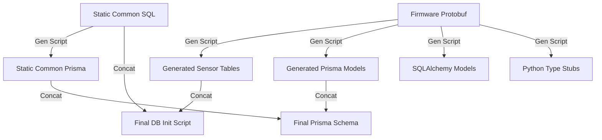

# Schema Driven Development (SDD) Overhaul

## 1. Motivation & Problem Statement

Currently, adding a new sensor or configuring a new car in the LHR Telemetry Stack requires manual synchronization across 4 different languages:
1.  **Database Schema:** `*_db_init.sql` (PostgreSQL definitions)
2.  **ORM Models:** `analysis/sql_utils/models.py` (SQLAlchemy classes)
3.  **Transport Protocol:** `stack/ingest/protobuf/*.proto` (Protobuf definitions)
4.  **Frontend Schema:** `viewer_tool/prisma/*.prisma` (Prisma/Next.js models)

## 2. The Solution: Single Source of Truth

We will use **Protobuf** as the source for dynamic sensor data and **SQL** as the source for static infrastructure.

### Architecture

## 3. Scope of Generation

### Static Components (Source: `common_schema.sql`)
*   **Infrastructure:** Roles, Functions, LUTs, Metadata Tables (`drive_day`, `event`, etc.).
*   **Workflow:** The generator parses `common_schema.sql` to produce the equivalent `common.prisma`.

### Generated Components (Source: `{car}.proto`)
*   **Root Table:** The `packet` table (with relations to all discovered sensor messages).
*   **Sensor Tables:** Generated directly from root sensor-message modules in proto (e.g., `dynamics`, `controls`, `pack`, `thermal`, `diagnostics`, `diagnostics_high`, `diagnostics_low`, `board_status`).
*   **Python:** SQLAlchemy models and DataClasses.
*   **Viewer Runtime Proto Mirror (Orion):** `analysis/database/viewer_tool/protobuf/orion.proto` for runtime protobufjs decode.

## 4. Implementation Plan

1.  **Refactor Static Files:** 
    *   Extract static SQL to `stack/ingest/common_schema.sql` (Master for static).
    *   Delete manual `common.prisma`.
2.  **Generator Script:** Create `telemtry/scripts/generate_schema.py`.
    *   **Part A (Proto -> X):** 
        *   Parse `.proto`.
        *   Generate SQL, Prisma, ORM, Type Stubs for sensors.
    *   **Part B (SQL -> Prisma):**
        *   Parse `CREATE TABLE` statements in `common_schema.sql`.
        *   Map Postgres types to Prisma types (e.g., `smallint` -> `Int`, `real` -> `Float`).
        *   Generate `common.prisma`.
3.  **Integration:**
    *   Update `sync_schema.sh` to orchestrate this generation and sync Orion viewer runtime proto from `drivers/longhorn-lib/protobuf/can_packets.proto`.
    *   Update `mqtt_handler.py` and Viewer Tool to use generated artifacts.
